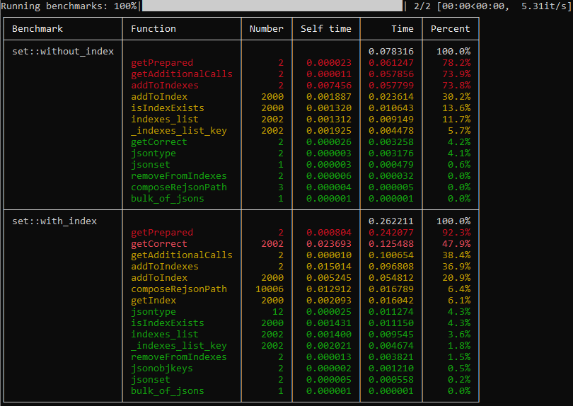

# 🗡 Sharpener

Handy benchmarking tool

<br/>

* Easy integration
* Beautiful results formatting



<br/>

## 💿 Installing

```python
python -m pip install sharpener-mentalblood
```

<br/>

## ✒️ Writing benchmarks

Real world example (see [bottomless_ReJSON](https://github.com/mentalblood/bottomless_ReJSON)):

```python
from sharpener import Benchmark

from tests import config
from bottomless_ReJSON import RedisInterface


class without_index(Benchmark):

    def prepare(self, **kwargs):

        self.interface = RedisInterface(host=config['db']['host'], port=config['db']['port'])
        self.interface.clear()
        self.interface.updateIndexesList()

    def run(self, items_number):
        self.interface['sessions'] = {
            str(i): {'state': 'new'}
            for i in range(items_number)
        }
    
    def clean(self, **kwargs):
        self.interface.clear()


class with_index(Benchmark):

    def prepare(self, **kwargs):

        self.interface = RedisInterface(host=config['db']['host'], port=config['db']['port'])
        self.interface.clear()
        self.interface.updateIndexesList()
        
        self.interface['sessions'].createIndex('state')
        self.interface.use_indexes_cache = False
        self.interface.use_indexes_cache = True

    def run(self, items_number):
        self.interface['sessions'] = {
            str(i): {'state': 'new'}
            for i in range(items_number)
        }
    
    def clean(self, **kwargs):
        self.interface.clear()
```

### `Benchmark` methods

`prepare`: performed before every _benchmark execution_

`run`: treated as _benchmark execution_

`clean`: performed after every _benchmark execution_

<br/>

## 📄 Configuring input parameters

File with name `benchmarks_default.json` treated as default config file

Example of such file:

```json
{
    
    "set::without_index": {
        "__n__": 1,
        "__calls__": [
            "index",
            "json",
            "getPrepared",
            "getCorrect",
            "getAdditionalCalls"
        ],
        "items_number": 1000
    },
    
    "set::with_index": {
        "__n__": 1,
        "__calls__": [
            "index",
            "json",
            "getPrepared",
            "getCorrect",
            "getAdditionalCalls"
        ],
        "items_number": 1000
    }

}
```

### Special parameters

`__n__`: number of executions (results will be averaged)

`__calls__`: list of substrings of functions names to show info of

Parameters other then special will be passed to `prepare`, `run` and `clean` benchmark class methods

<br/>

## 📊 Launching benchmarks

For default config:

```bash
python -m sharpener run
```

For config with file name `benchmarks_NAME.json`:

```bash
python -m sharpener run -c NAME
```

